# Проверим тесты
Установлю pytest 
 ```shell
   pip install pytest
```
и запущу тесты

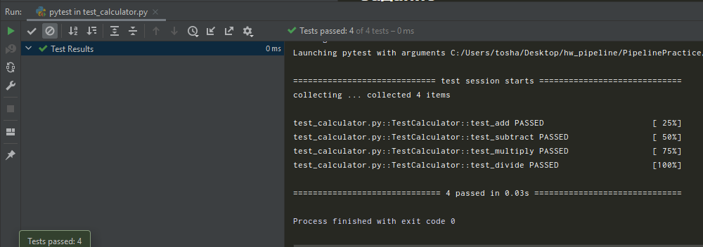

Все тесты пройдены.

Теперь допущу ошибку в классе Calculator и проверю тесты 

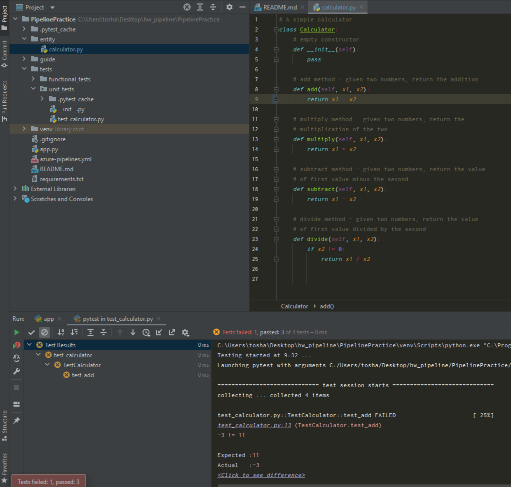

... сломались.

Для функционального тестирования установлю selenium
```shell
pip install selenium
```
Запущу веб-приложение
```shell
python app.py
``` 
и тесты
```shell
py.test tests/functional_tests
```

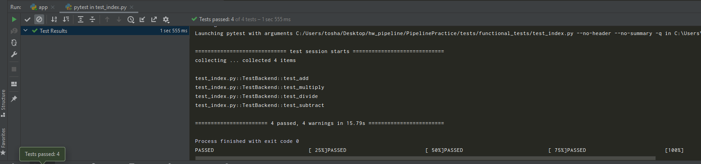

полет нормальный. Теперь сломаю преобразование в инт переменных для суммирования

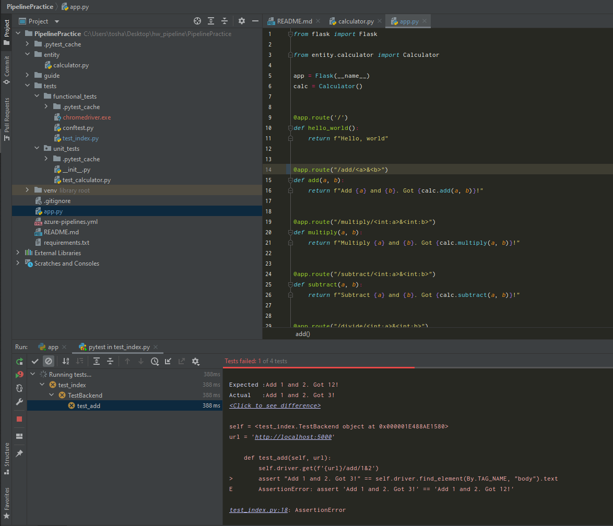

Упала ошибка. Возвращаю все к прежнему состоянию и пушу в гит.

# Переходим к Azure

Захожу в вами созданную организацию

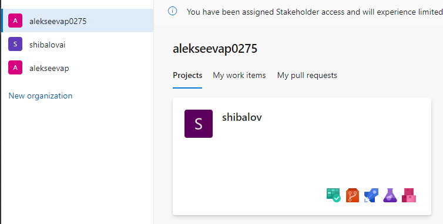

Создаю новый пайплайн и указываю git как источник кода

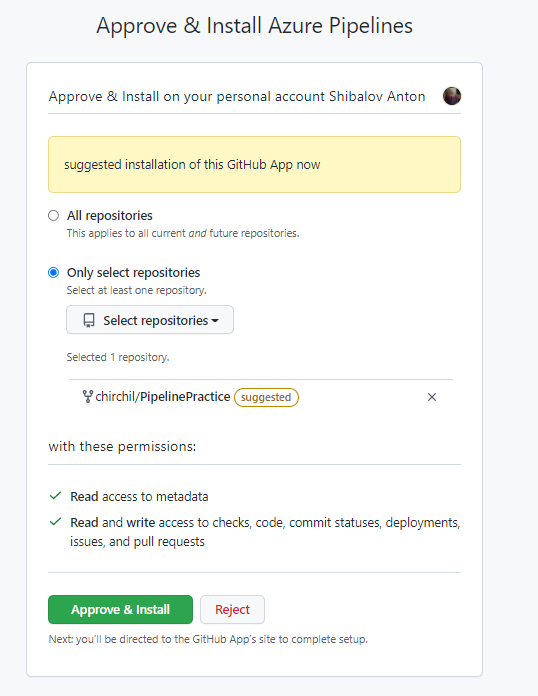

В yaml файл вставляю следующий код (триггерю на мастер и девелоп)
```yaml
# Python package
# Create and test a Python package on multiple Python versions.
# Add steps that analyze code, save the dist with the build record, publish to a PyPI-compatible index, and more:
# https://docs.microsoft.com/azure/devops/pipelines/languages/python

trigger: # в данном блоке определяется, при каком событии запускать пайплайн
- master # запускаем, как только пришел новый коммит в ветку master
- develop # запускаем, как только пришел новый коммит в ветку develop

pool: # здесь определяем образ докера, в котором запускается приложение и версию интерпритатора
    vmImage: ubuntu-latest # выбираем ubuntu
strategy: # здесь выбираем стек программирования
    matrix: # matrix позволяет запускать параллельные конвейеры, если требуются разные версии
#    Python36: # пока отключаем запуск на 3.6
#      python.version: '3.6'
    Python37: # запускаем на 3.7
        python.version: '3.7'

steps: # здесь указываются шаги конвейера
- task: UsePythonVersion@0 # используем версию питона
    inputs:
    versionSpec: '$(python.version)'
    displayName: 'Use Python $(python.version)'

- script: | # запускаем апдейт питона, устанавливаем зависимости (в нашем случае flask)
    python -m pip install --upgrade pip
    pip install -r requirements.txt
    displayName: 'Install dependencies' # здесь отображается название текущей задачи

- script: | # запускаем юнит тесты (без функциональных)
    pip install pytest 
    pytest tests/unit_tests && pip install pycmd && py.cleanup tests/
    displayName: 'pytest'

- task: ArchiveFiles@2 # архивируем наш проект чтобы опубликовать артефакт. Артефакт это по сути то, что отдает клиенту (например архив с программой)
    displayName: 'Archive application'
    inputs:
    rootFolderOrFile: '$(System.DefaultWorkingDirectory)/'
    includeRootFolder: false
    archiveFile: '$(Build.ArtifactStagingDirectory)/$(Build.BuildId).zip'

- task: PublishBuildArtifacts@1 # публикуем артефакт как результат нашего пайплайна
    displayName: 'Publish Artifact: drop'

```

Запускаю пайплайн, смотрю за результатами и проверяю, что все выполнилось корректно

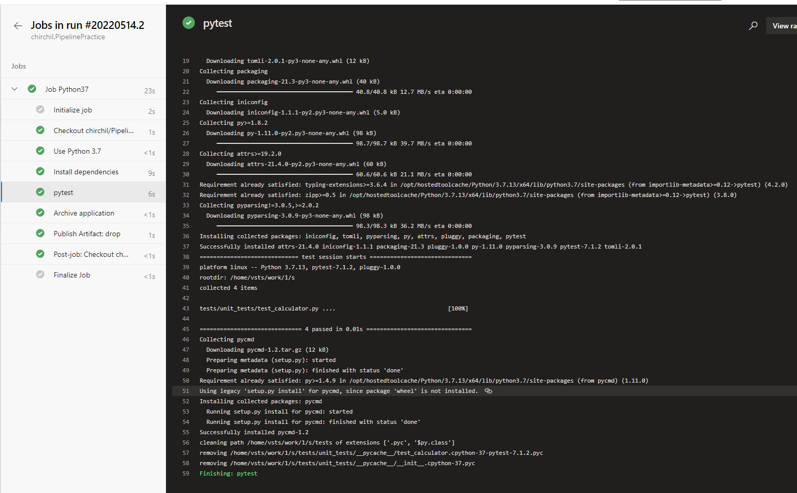

Артефакт:

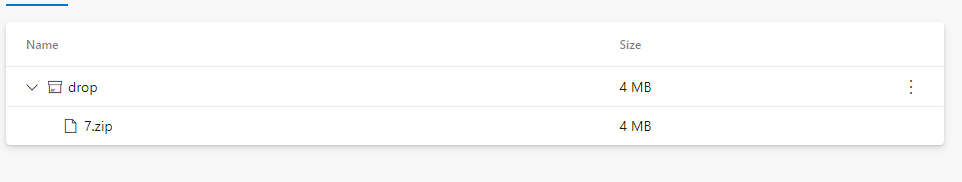

И добавляю себе в гит бейдж

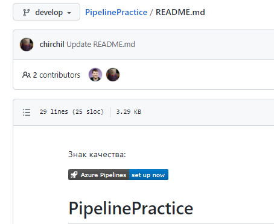

# Continious deployment
Создал ресурсную группу

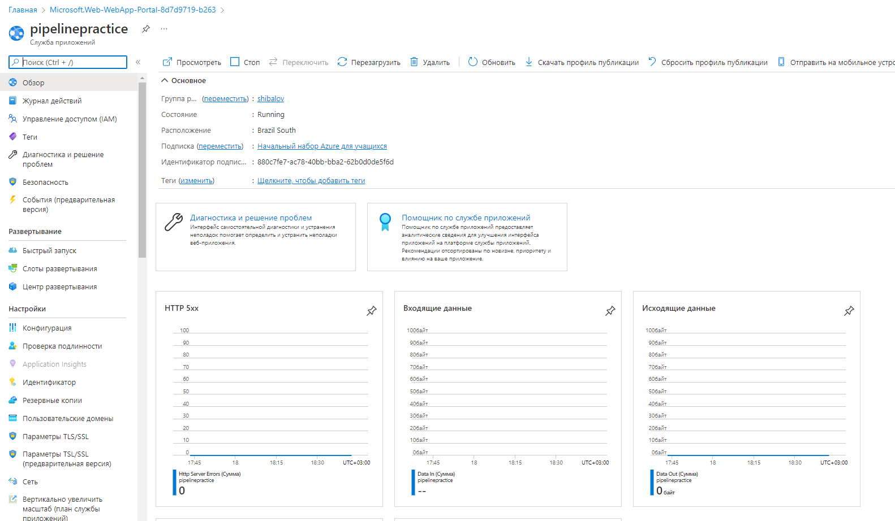

Далее создаю Release и в него добавляю ранее упомянутый артефакт

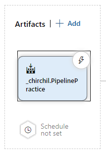

Следующим шагом добавляю deploy 

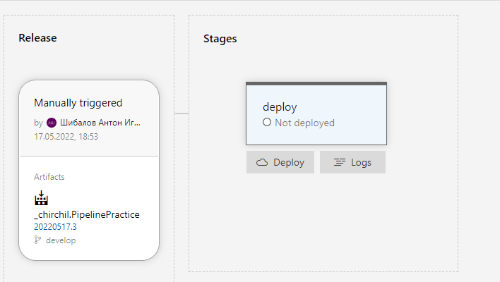

И нажимаю create release 

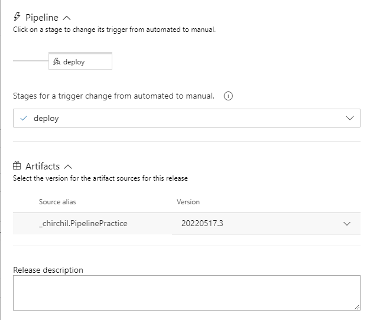

Смотрим результаты

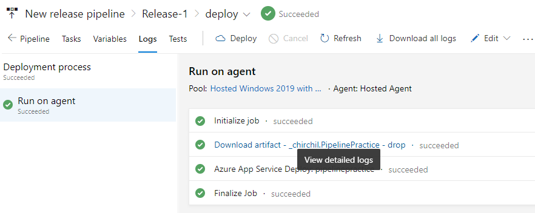
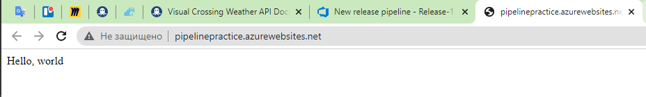

Настрою функциональное тестирование

Добалвю новый stage 'test'

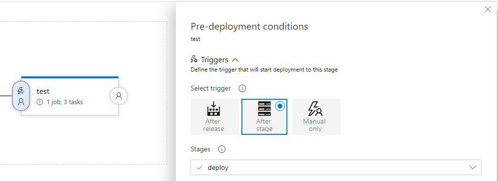

Со следующим сценарием и параметрами

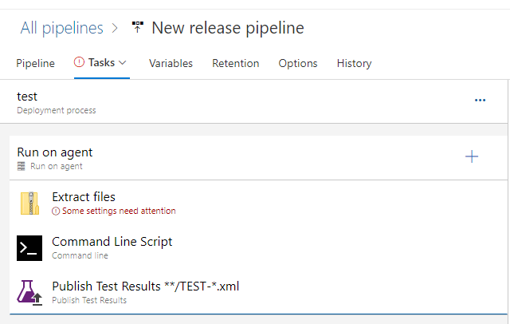
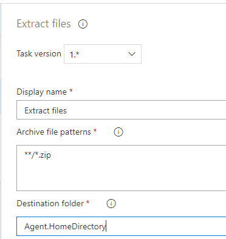
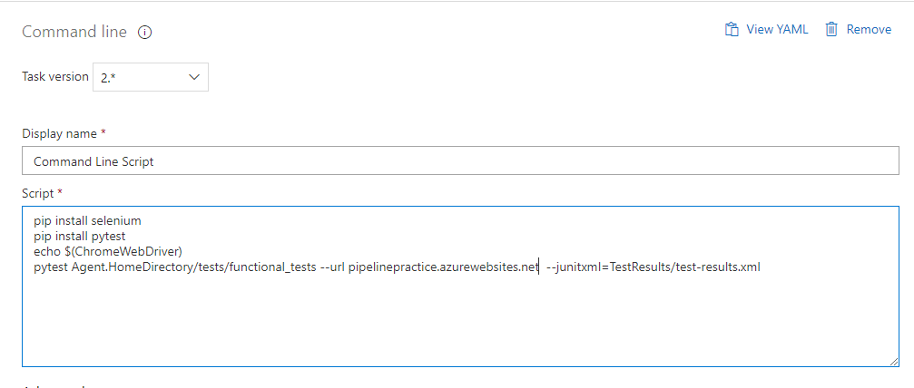

Создаю release

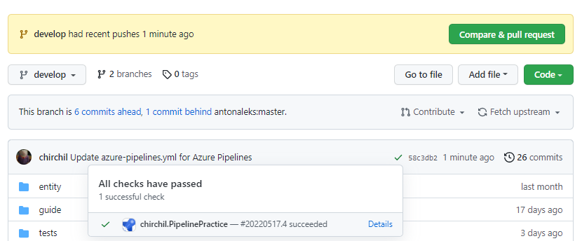

Все тесты выполнились

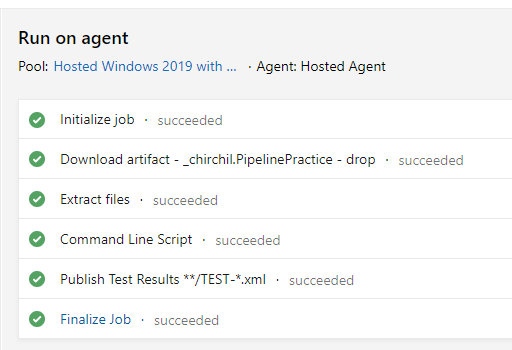

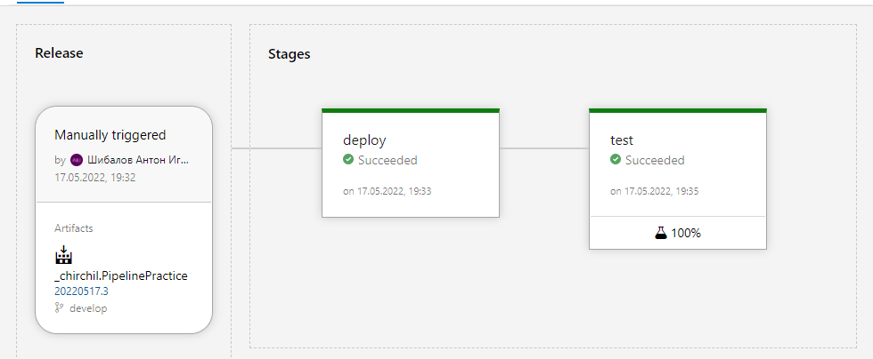

На гитхабе сделаю тестовый коммит и вижу, что тесты прошли


## Так же я попал в число тех, кому не повезло с колбочкой на Azure, поэтому на этом все!


